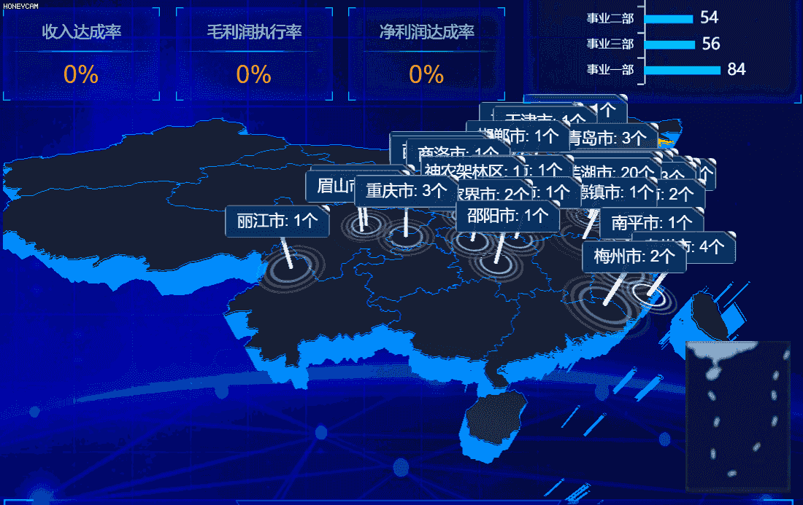
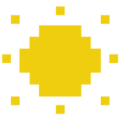
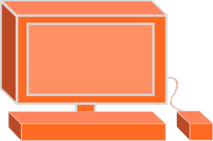
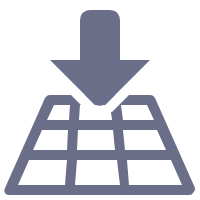

# 简单使用 ThreeJS

#### 参考文章：

[郭隆帮技术博客](http://www.yanhuangxueyuan.com/)

## 前言

前段时间公司做大屏，需要在中间放个地图，再显示几个柱状图，点击效果啥的，本来用 Echarts 就做好了，但是...
领导说要 3D 的，那种能 360° 转的，看上去高端大气上档次的。巧的是公司现在活儿饱和了，没人能做(本来公司里也没人会)，于是就我来做了，可以说是很幸运，趁机学习 ThreeJS，学完感觉还是很有用的。

于是记录一下这次写的 3D 地图的实现方式，再总结一下 ThreeJS 在 Vue 的项目中使用的方法。日后遇到相似的情况都可以用起来。

### **先来看一下一个简单的效果（图上的标签和柱子待后续我有时间再完善）**



## ThreeJS

官方就是这么简单的一个介绍。

> "Javascript 3D library"

OpenGL 是一个跨平台 3D/2D 的绘图标准，WebGL 则是 openGL 在浏览器上的一个实现。web 前端开发人员可以直接用 WebGL 接口进行编程，但 WebGL 只是非常基础的绘图 API，需要编程人员有很多的数学知识、绘图知识才能完成 3D 编程任务，而且代码量巨大。Threejs 对 WebGL 进行了封装，让前端开发人员在不需要掌握很多数学知识和绘图知识的情况下，也能够轻松进行 web 3D 开发，降低了门槛，同时大大提升了效率。

## ThreeJS 的几个要素

（以下具体 API 可以[参照文档](https://www.techbrood.com/threejs/docs/)）

<div class="tags-outer">
  <div class="tag">
    <div class="tag-content">场景</div>
  </div>
  <div class="tag">
   
   <div class="tag-content">相机</div>
  </div>
  <div class="tag">
   
   <div class="tag-content">灯光</div>
  </div>
  <div class="tag">
    
   <div class="tag-content">控制器</div>
  </div>
  <div class="tag">
   
   <div class="tag-content">渲染器</div>
  </div>
</div>

<style lang="stylus">
  .tags-outer{
    width:80%;
    display:flex;
    justify-content:space-around;
    align-items:center;
    margin:20px 0;
  }
  .tag{
    display:flex;
    align-items:center
  }
  .tag-content{
    background:#3AACF9;
    color:#eee;
    padding:0 6px;
    border-radius:4px;
  }
  .tag-icon{
    width:20px;
    height:20px;
    background:#fff;
    border-radius:4px;
    margin-right:4px;
    padding:0 4px;
  }
</style>

### 1. 场景

场景就像环境一样，用来放我们要添加的所有东西。

```js
this.scene = new THREE.Scene()
```

### 2. 相机

相机可以当作我们的眼睛，没有相机，我们就看不到任何东西。相机有很多种。

```js
camera = new THREE.PerspectiveCamera(fov, aspect, near, far)
camera.position.set(0, -18, 15)
```

### 3. 灯光

就像我们没有灯光就看不见东西一样，我们需要灯光来照亮东西。光分很多种，有环境光，点光源，聚光灯，平行光等等，不同的光的照亮效果不一样。

```js
// 环境光
ambientLight = new THREE.AmbientLight(0xbbbbbb)
scene.add(ambientLight)
// 平行光  （与点光源不同 是从一个方向来 不是从一个点）
directionalLight = new THREE.DirectionalLight(0x666666)
directionalLight.position.set(10, -50, 300)
scene.add(directionalLight)
```

### 4. 场景控制器

这里我们用它来控制场景里的所有东西，当我们拖动场景缩小放大的时候，实际上就是在控制相机移动。

```js
controls = new OrbitControls(camera, renderer.domElement)
```

### 5. 渲染器

渲染器，把注册的所有东西渲染到场景中。

```js
//注册渲染器
const canvas = document.querySelector('#map')
renderer = new THREE.WebGLRenderer({ canvas, alpha: true })
//渲染
renderer.render(this.scene, this.camera)
requestAnimationFrame(this.render)
```

**以上就是重要的几点，为什么没有把模型算在里面呢**

**因为 没有模型我图啥 当然还有一部分原因是 模型的内容比较多**

## 绘制一个 3D 地图，并且带鼠标高亮

**这里详细讲解一下如何画一个地图，并且做一个鼠标移动高亮的效果。**

::: tip 几种方式

1.我们可以用 json 数据，收尾连线的方式，画出轮廓线和中国地图，再挤压画出的平面图形，让其成为有厚度的 3D 模型。

2.我们也可以直接引入成型的地图模型，渲染就完事了。不过对于这种简单的模型，建议使用 json 数据画出来，因为加载模型的话，模型大小是一个问题，网页打开时加载模型需要一些时间，影响体验，而且，你得有一个愿意配合你的小伙伴。

:::

**我们采用上面所说的第一种方式**

简单讲解一下画模型的思路：
首先，模型由两点构成 **几何体** 和 **网格**，我们可以理解为，一个没穿衣服的光秃秃模型和它的衣服。所以显然易见，我们选择一个几何体（或者画出一个几何体），然后给他穿个衣服（给他捯饬捯饬，弄点颜色透、明度之类的属性，也可以贴图上去）

### 1. 画出轮廓线

```js
/* group-组，将一个国家的轮廓线放在同一个 group 中（分组），这样可以在场景中进行整体控制
   如果不分组，在复杂场景中过多的模型对象会很混乱，难以维护 */
var group = new THREE.Group() // 一个国家多个轮廓线条line的父对象

/*  pointArr：行政区一个多边形轮廓边界坐标(2个元素为一组，分别表示一个顶点x、y值)
    通过BufferGeometry构建一个几何体，传入顶点数据
    通过Line模型渲染几何体，连点成线
    LineLoop和Line功能一样，区别在于首尾顶点相连，轮廓闭合  */

// 创建一个Buffer类型几何体对象
var geometry = new THREE.BufferGeometry()
// 类型数组创建顶点数据
var vertices = new Float32Array(pointArr)
// 创建属性缓冲区对象
var attribue = new THREE.BufferAttribute(vertices, 3) // 3个为一组，表示一个顶点的xyz坐标
// 设置几何体attributes属性的位置属性
geometry.attributes.position = attribue
// 材质对象
var material = new THREE.LineBasicMaterial({
  color: 0x008bfb // 线条颜色
})
// var line = new THREE.Line(geometry, material);// 线条模型对象(轮廓不闭合)
var line = new THREE.LineLoop(geometry, material) // 首尾顶点连线，轮廓闭合
group.add(line)
```

### 2. 画出地图形状，并且挤压出厚度

```js
var shapeArr = [] // 轮廓形状Shape集合
pointsArrs.forEach((pointsArr) => {
  var vector2Arr = []
  // 转化为Vector2构成的顶点数组
  pointsArr[0].forEach((elem) => {
    vector2Arr.push(new THREE.Vector2(elem[0] - this.offsetX, elem[1] - this.offsetY))
  })
  var shape = new THREE.Shape(vector2Arr)
  shapeArr.push(shape)
})
// MeshBasicMaterial:不受光照影响
// MeshLambertMaterial：几何体表面和光线角度不同，明暗不同
var material1 = new THREE.MeshPhongMaterial({
  color: this.bgColor,
  specular: this.bgColor
})
var material2 = new THREE.MeshBasicMaterial({
  color: 0x008bfb
})

// 拉伸造型
var geometry = new THREE.ExtrudeBufferGeometry(
  shapeArr, // 多个多边形二维轮廓
  // 拉伸参数
  {
    // depth：根据行政区尺寸范围设置，比如高度设置为尺寸范围的2%，过小感觉不到高度，过大太高了
    depth: height, // 拉伸高度
    bevelEnabled: false // 无倒角
  }
)
var mesh = new THREE.Mesh(geometry, [material1, material2]) // 网格模型对象
```

### 3. 渲染模型

:::tip 为什么要做响应式处理？

1.我们先来了解一下 `requestAnimationFrame`

[1] requestAnimationFrame 会把每一帧中的所有 DOM 操作集中起来，在一次重绘或回流中就完成，并且重绘或回流的时间间隔紧紧跟随浏览器的刷新频率

[2] 在隐藏或不可见的元素中，requestAnimationFrame 将不会进行重绘或回流，这当然就意味着更少的 CPU、GPU 和内存使用量

[3] requestAnimationFrame 是由浏览器专门为动画提供的 API，在运行时浏览器会自动优化方法的调用，并且如果页面不是激活状态下的话，动画会自动暂停，有效节省了 CPU 开销

2.即使用了 requestAnimationFrame，我们还要注意的是：

相机的会在每次`render()`时计算更新`投影矩阵`,但是如果渲染区域没有变化的话，我们就没有必要一直计算更新，所以我们在每次执行渲染函数时,计算出渲染区域大小是否发生变化，如果没有，就不去更新它，以此节省性能
:::

```js
// 响应处理函数
resizeRendererToDisplaySize(renderer) {
  const canvas = renderer.domElement
  const width = canvas.clientWidth
  const height = canvas.clientHeight
  // width和height是一开始记录的在网页种渲染区域的大小
  const needResize = canvas.width !== width || canvas.height !== height
  if (needResize) {
    // 重新设置渲染器的渲染区域
    renderer.setSize(width, height, false)
  }
  return needResize
}


//响应式渲染
if (this.resizeRendererToDisplaySize(renderer)) {
  const canvas = renderer.domElement
  // 重新计算相机的属性
  camera.aspect = canvas.clientWidth / canvas.clientHeight
  // 更新相机的投影矩阵
  camera.updateProjectionMatrix()
}
controls.update()
renderer.render(scene, camera)
// 智能刷新
this.globalID = requestAnimationFrame(this.render)
```

### 4. 鼠标移动 区域高亮

实现方法：从一个地方发射一条射线，调用方法返回交叉点的数组,对穿过的模型进行操作

```js
// 鼠标移动事件 高亮
handleMousemove(event) {
  // event.preventDefault()
  // 注册一个射线
  this.raycaster = new THREE.Raycaster()
  // 计算出位置坐标
  let mouse = new THREE.Vector2(0, 0)
  const canvas = document.querySelector('#map')
  mouse.x = (event.offsetX / canvas.offsetWidth) * 2 - 1
  mouse.y = -(event.offsetY / canvas.offsetHeight) * 2 + 1
  // 用一个新的原点和方向向量来更新射线
  this.raycaster.setFromCamera(mouse, camera)
  // 检查射线和物体之间的所有交叉点（默认不包含后代） 返回的是对象数组
  let intersects = this.raycaster.intersectObjects(meshGroup.children)
  // 取第一个穿过的模型对象
  this.previousObj.material[0].color = new THREE.Color(this.bgColor)
  // 操作属性,此处为改变颜色,就达到了高亮的效果
  if (intersects[0] && intersects[0].object) {
    intersects[0].object.material[0].color = new THREE.Color(0xffaa00)
    this.previousObj = intersects[0].object
  }
},
```

### 补充 （2021.12.21）

页面卸载的时候 一定要将 **各种**`渲染器` 卸载 否则再次进入页面的时候可能出现一些奇怪的 bug 比如多一个卡住的地图

## 总结

以上简单记录了如何画一个 3D 地图，其实总的来说，简单的模型没有什么难度，但是看下来大家也明白，写一套出来代码量也不少，优化的空间很大。

就像我们拆组件、写方法一样，我们可以将画轮廓、画地图的方法包装一下放到 JS 文件里导出，只要给 json 数据，就直接给他返回一个模型，然后再封装一下`render()`函数，这样日后画一个地图就会很方便。还有鼠标高亮的效果，也可也封起来。

Threejs 的用途远不止此，日后学习历程还会记录在此 :ghost:
